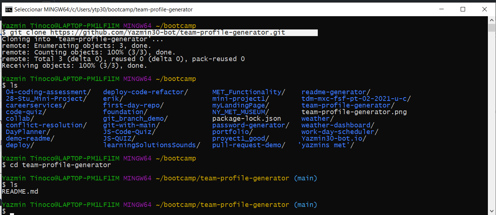
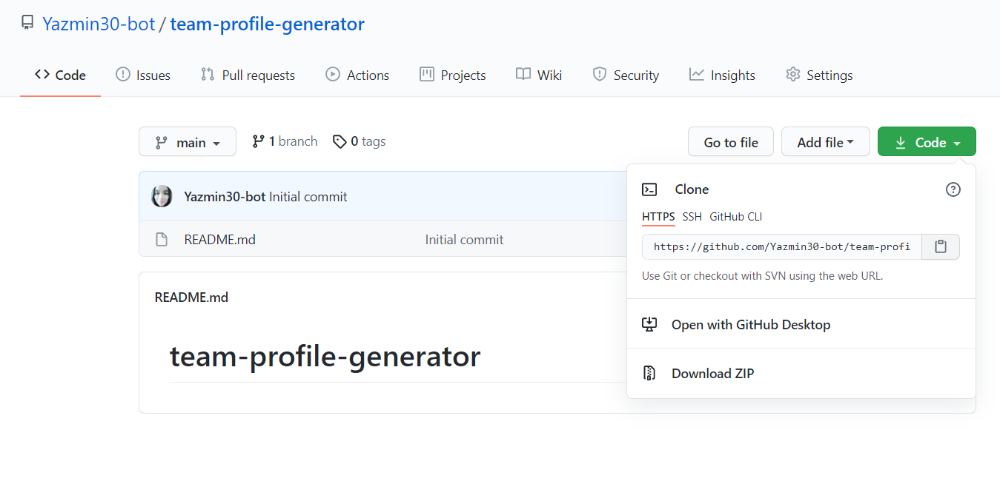

# Team Profile Generator


## Description
  
  Create a command-line application that takes in information about employees on a software engineering team, then generates an HTML webpage that displays summaries for each person. 
  
## Table of Contents
  
  *[Installation](#installation)
  
  *[Usage](#usage)
  
  *[Build-With](#build-with)

  *[Links](#links)

  *[Author](#author)
  
  *[Contributing](#contributing)

  *[Tests](#tests)
  
  *[Questions](#questions)

## Installation
  * Go to the following link [https://github.com/Yazmin30-bot/team-profile-generator](https://github.com/Yazmin30-bot/team-profile-generator/) and clone it 
  * Go to Git-bash and page the github's with the following code
    ```
    $ git clone https://github.com/Yazmin30-bot/team-profile-generator.git 
    ``` 
    
  * When you first set up the project before installing any dependencies, make sure that your repo includes a package.json with the required dependencies. You can create one by running 
    ```
    npm init
  
    ``` 
  * For this project is needed to add the inquirer dependency to package.json file  
    ```
      "dependencies": {
        "inquirer": "^7.3.3",
        "replace": "^1.2.1"
        },
      "devDependencies": {
        "jest": "^24.8.0"
        },
    ``` 
    

  * To install necessary dependencies, run the following command:
    ```
    npm install
    npm install inquirer
    npm install replace
    ```
## Usage
  * The application will be invoked by using the following command:

    ```bash
    node index.js
    ```
  * The following animation demonstrates the application functionality, Also you can find the video on the links section:  
    
   
## Build with 
  * [Javascript](https://www.javascript.com/) - `Javascript`
  * [NodeJs](https://nodejs.org/en/) - `NodeJs`

## Links
  * The Video of the deployed application.
  [https://drive.google.com/file/d/1Wx9AGv-Rraxj6ipIqZJ93wIHSJCBXwvG/view?usp=sharing/](https://drive.google.com/file/d/1Wx9AGv-Rraxj6ipIqZJ93wIHSJCBXwvG/view?usp=sharing/)

  * The URL of the GitHub repository.                                         
  [https://github.com/Yazmin30-bot/team-profile-generator/](https://github.com/Yazmin30-bot/team-profile-generator/)

## Author 
  * **`Yazmin Tinoco`**   - [Yazmin30-bot](https://github.com/Yazmin30-bot/)

## Contributing
  Pull requests are welcome. For major changes, please open an issue first to discuss what you would like to change. 

## Tests
  
  To run tests, run the following command:
  
  ```
  npm test
  ```  
  
  
## Questions
  If you have any questions about the repo, open an issue or contact me directly at ytip30@gmail.com.
  You can find more of my work at [Yazmin30-bot](https://github.com/Yazmin30-bot/).  
